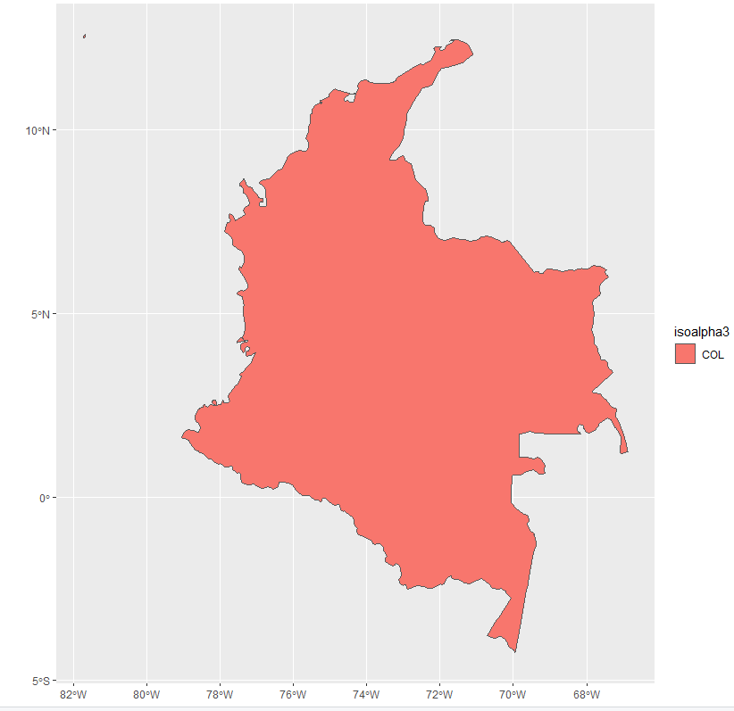
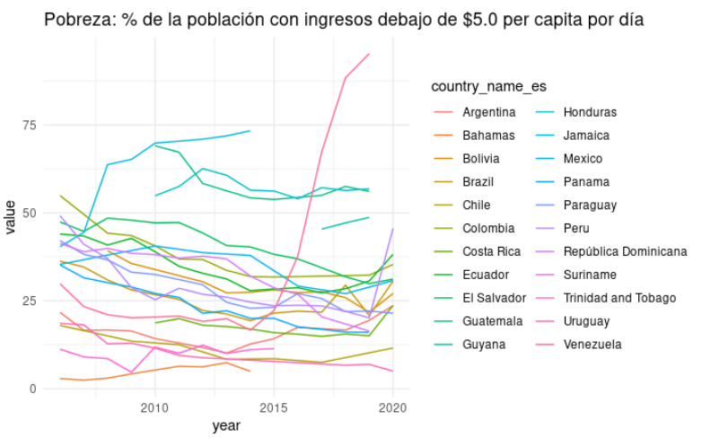
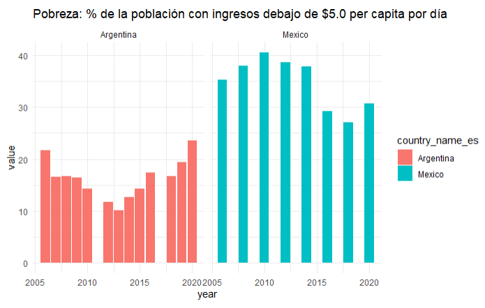
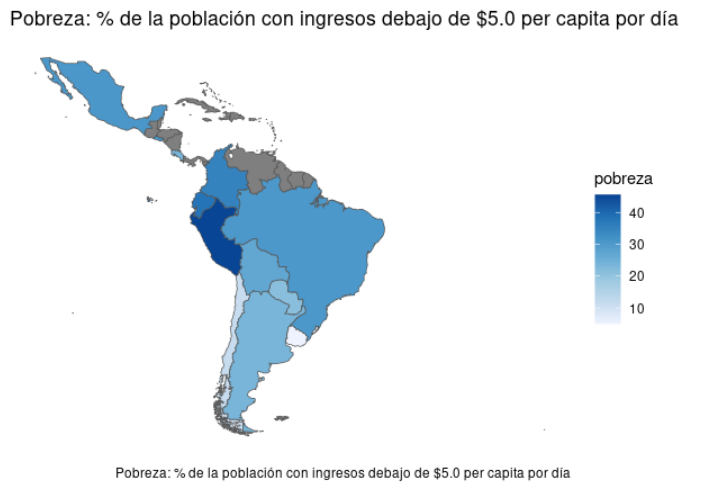

# SCLDataR
Important: This package is in Beta - expect changes and updates


## Installation
For the moment this package is only available from github.
To install the development version:

``` r
install.packages("devtools")
install.packages("sf")

devtools::install_github("EL-BID/idbsocialdataR") 

```

# Data

With this function you can download any indicator from the SCLdata collections. You can browse this [dictionary](https://github.com/EL-BID/idbsocialdataR/blob/main/data/scldata_dict.csv) to see what is available.


## Indicators
``` r
data <- idbsocialdataR:::query_indicator(indicator = 'pobreza',
                                   countries = 'COL,ECU,BRA,URY',
                                   categories = 'area')
```

``` r
# A tibble: 5 x 23
  iddate  year month idgeo  isoalpha3 source  indicator area  value     se    cv sample theme_es theme_en
  <chr>  <dbl> <lgl> <chr>  <chr>     <chr>   <chr>     <chr> <dbl>  <dbl> <dbl>  <dbl> <chr>    <chr>   
1 year    2006 NA    count… BRA       BRA-PN… pobreza   rural  62.0 0.206  0.333  64606 ingreso  income  
2 year    2006 NA    count… BRA       BRA-PN… pobreza   urban  30.9 0.0875 0.283 332088 ingreso  income  
3 year    2012 NA    count… BRA       BRA-PN… pobreza   rural  46.1 0      0      51214 ingreso  income  
4 year    2012 NA    count… BRA       BRA-PN… pobreza   urban  17.9 0      0     297772 ingreso  income  
5 year    2015 NA    count… BRA       BRA-PN… pobreza   rural  43.0 0      0      51544 ingreso  income  
# … with 9 more variables: source_en <chr>, source_es <chr>, country_name_en <chr>,
#   country_name_es <chr>, valuetype <chr>, label_en <chr>, label_es <chr>, description_en <chr>,
#   description_es <chr>
```


# Metadata

## Dictionary

```r
dictionary <- idbsocialdataR:::query_dictionary() %>% select(collection, indicator, label_es)

```

```r
# A tibble: 757 x 3
   collection                      indicator        label_es                                             
   <chr>                           <chr>            <chr>                                                
 1 Household Socio-Economic Surve… urbano_ci        "Porcentaje dela población que reside en zonas urban…
 2 Household Socio-Economic Surve… unip_ch          "Porcentaje de hogares unipersonales "               
 3 Household Socio-Economic Surve… union_ci         "Porcentaje de personas en unión formal o informal"  
 4 Household Socio-Economic Surve… tamh_ch          "Tamaño promedio del hogar"                          
 5 Household Socio-Economic Surve… rural_ci         "Porcentaje de la población que reside en zonas rura…
```

### countries, Sources & themes

```r
countries <- idbsocialdataR:::get_countries()

sources <- idbsocialdataR:::get_sources()

themes <- idbsocialdataR:::get_themes()
```


## BaseMaps

```r
idbsocialdataR:::get_map(level = '1', isoalpha3 = 'COL') %>% 
  ggplot(aes(fill = isoalpha3)) +
  geom_sf(size = 0.25)
```




# Quick-Plots

You can always build your own graphs but sometimes it is useful to have some quick-plots.


### Line Chart

``` r
idbsocialdataR:::idbsocial_plot('pobreza',type='line', countries='All' ,yearstart = 2000, yearend = 2020, categories='All')

```




### Bar Chart

``` r
idbsocialdataR:::idbsocial_plot('pobreza',type='bar', countries='MEX,ARG' ,yearstart = 2000, yearend = 2020)

```




### Maps

``` r
idbsocialdataR:::idbsocial_choropleth('pobreza', year = 2020, isoalpha3='All')

```




### Limitation of responsibilities
---
The IDB is not responsible, under any circumstance, for damage or compensation, moral or patrimonial; direct or indirect; accessory or special; or by way of consequence, foreseen or unforeseen, that could arise:

I. Under any concept of intellectual property, negligence or detriment of another part theory; I
ii. Following the use of the Digital Tool, including, but not limited to defects in the Digital Tool, or the loss or inaccuracy of data of any kind. The foregoing includes expenses or damages associated with communication failures and / or malfunctions of computers, linked to the use of the Digital Tool.