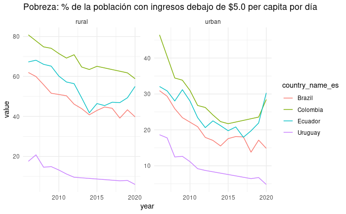

# SCLDataR


## Installation

install the development version of scldataR:

``` r
install.packages('devtools')
library(devtools)
devtools::install_github("BID-DATA/idbsocialdataR") 
```

Indicators dictionary

```r
idbsocialdataR::scldata_dict %>% 
    select(collection, indicator, label_es)
# A tibble: 223 x 3
   collection              indicator    label_es                             
   <chr>                   <chr>        <chr>                                
 1 Household Socio-Econom… jefa_ch      % de hogares con jefatura femenina   
 2 Household Socio-Econom… jefaecon_ch  % de hogares con jefatura económica …
 3 Household Socio-Econom… union_ci     % de población en unión formal o inf…
 4 Household Socio-Econom… miembro6_ch  % de hogares con al menos un miembro…
 5 Household Socio-Econom… miembro6y16… % de hogares con al menos un miembro…
 6 Household Socio-Econom… miembro65_ch % de hogares con al menos un miembro…
 7 Household Socio-Econom… unip_ch      % de hogares unipersonales           
 8 Household Socio-Econom… nucl_ch      % de hogares nucleares               
 9 Household Socio-Econom… ampl_ch      % de hogares ampliados               
10 Household Socio-Econom… comp_ch      % de hogares compuestos              
# … with 213 more rows

```


## Example

This is a basic example

``` r

data <- scldataR:::query_indicator(indicator = 'pobreza',
                                   countries = 'COL,ECU,BRA,URY',
                                   categories = 'area')
```

# Plot
``` r
library(ggplot2)
data %>% ggplot(aes(x=year, y=value,
                  color=country_name_es)) +  
  geom_line(size = .5) + 
  facet_wrap(~area, scales = "free_y")+
  labs(title = data$label_es) + theme_minimal()
```



